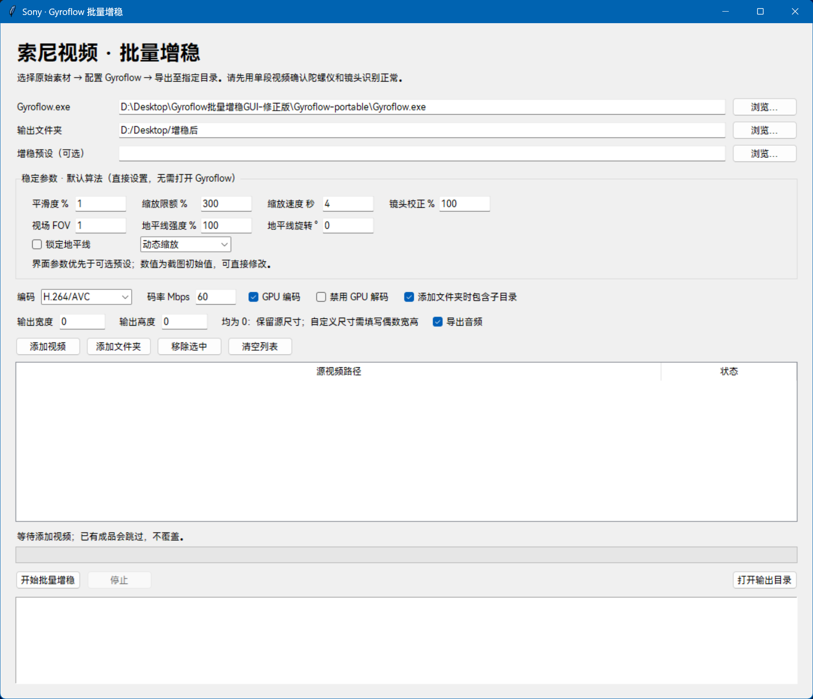
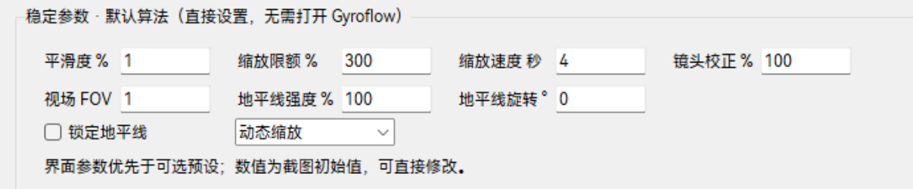
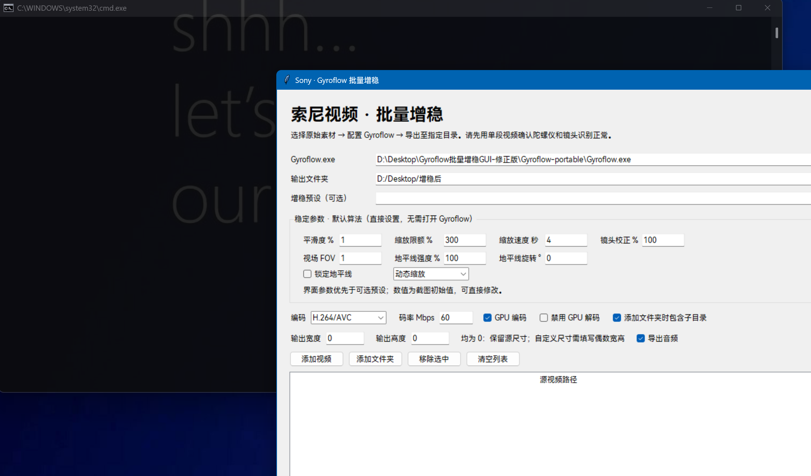

# Gyroflow-batch-processing-script--Gyroflow批量处理脚本
近日有批量处理相机视频的需求，苦于索尼zve10防抖功能极差，所以尝试使用后期软件来实现。
但是Gyroflow一次只可以处理一个视频，我就用ChatGPT生成了一个简易脚本，脚本提供GUI界面，可以大致调整原版Gyroflow软件内的参数，能一次性处理多个视频，可指定输入输出文件夹，对我来说够用，欢迎捉虫。
## 界面预览

使用Python构建

## 功能特征

提供原版Gyroflow功能的基础修改，一般来说够用

## 注意事项

目前第一版属于赶鸭子上架的类型，打开脚本会连带一个控制台窗口，关掉会关闭脚本，后期会优化
